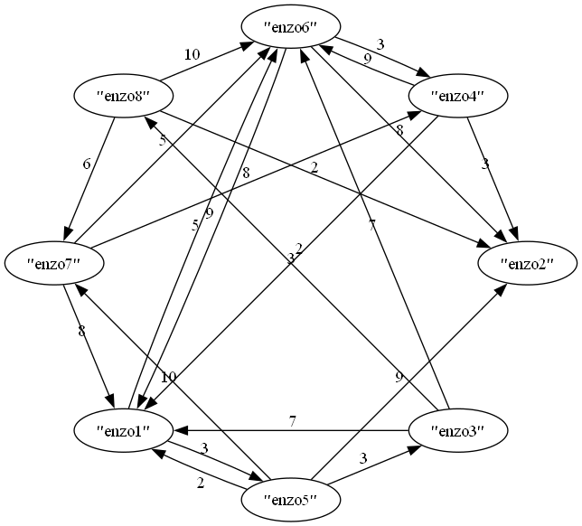

# Minimum Path Finder (Rust) — Grafos dirigidos con visualización

# ! Se arregló el problema de antivirus detectandolo como virus, pero puede que siga saliendo, si tienes algun problema con el codigo o sugerencia para hacerlo más seguro, comentamelo.

Genera **grafos dirigidos y ponderados** en Rust (con [`petgraph`](https://crates.io/crates/petgraph)), de forma **automática o manual**, garantizando **conectividad débil** (como una red de caminos reales).  
Además, exporta a **Graphviz (.dot)** y genera una **imagen en disposición circular** (nodos “sentados en una mesa” 🟢).

> La imagen se genera al ejecutar el programa; si aún no existe, verás un placeholder más abajo.



---

## Por ahora tiene:

- Grafo **dirigido** con **pesos** aleatorios (1..=10).
- Opción de **etiquetas automáticas** (“Nodo1”, “Nodo2”, …) o **manuales**.
- **Conectividad débil garantizada**: siempre hay un camino si ignoras dirección.
- **Visualización circular**:
  - **Ordenada y determinística** (posiciones fijas): `grafo_circular.png`
  - Alternativa rápida con **Graphviz `circo`**: `grafo_circo.png`
- Exportación a **DOT** para inspección o uso externo.
- Implementación con Dijkstra para encontrar el minimo camino.
---

## Requisitos 

- **Rust** y **Cargo**  
  <https://www.rust-lang.org/tools/install>
- **Graphviz** (para generar PNG)
  - **Linux (Debian/Ubuntu):** `sudo apt install graphviz`
  - **macOS (Homebrew):** `brew install graphviz`
  - **Windows (Chocolatey):** `choco install graphviz`  
  > Asegúrate de tener `dot` y `neato` en tu `PATH`.

---

## 🚀 Instalación y ejecución

```bash
# Clonar el repo
git clone https://github.com/enzocipher/minimum_path_finder.git
cd minimum_path_finder

# Ejecutar
cargo run
